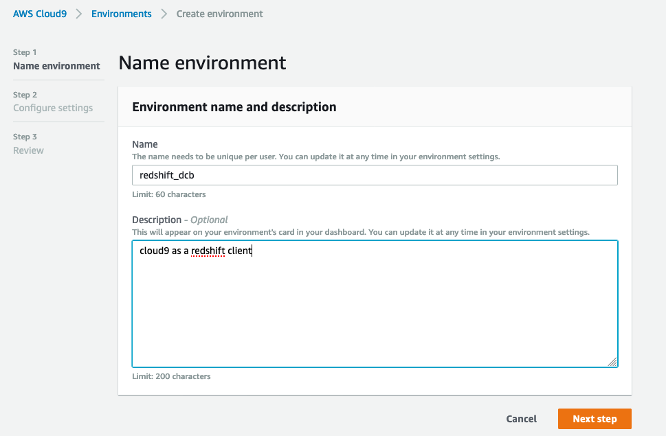
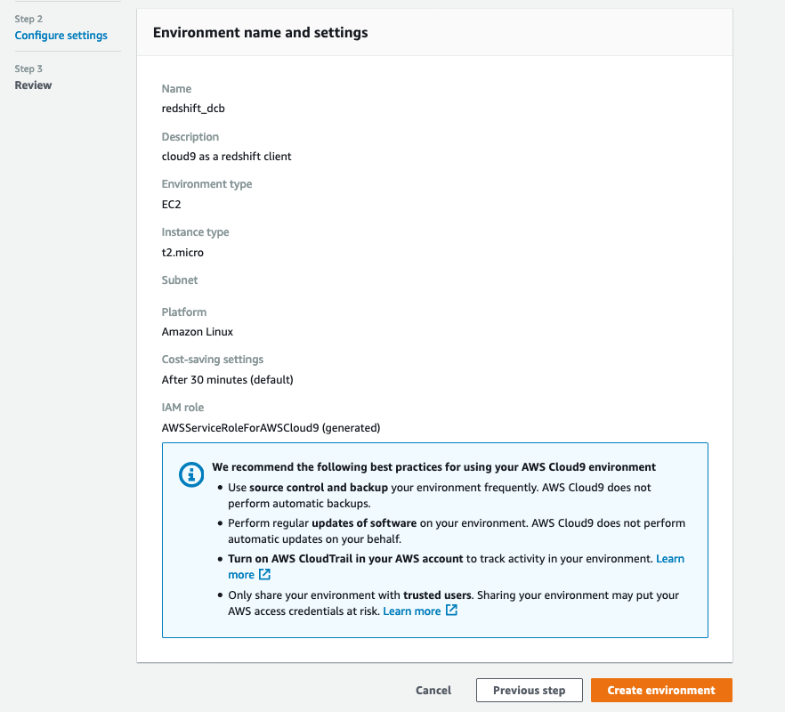
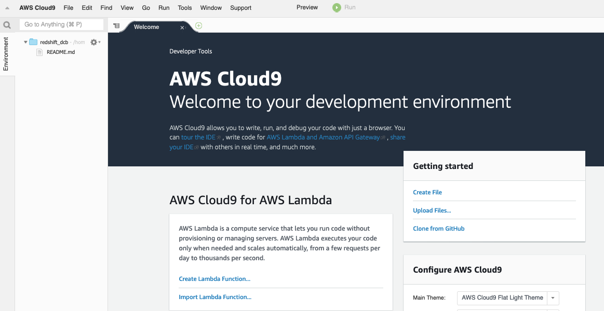
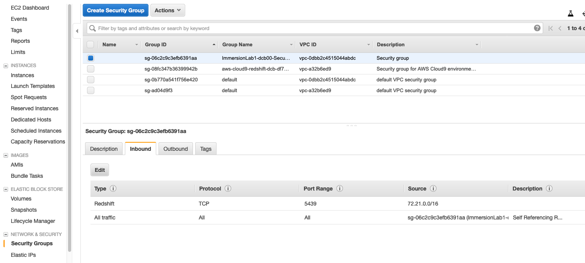
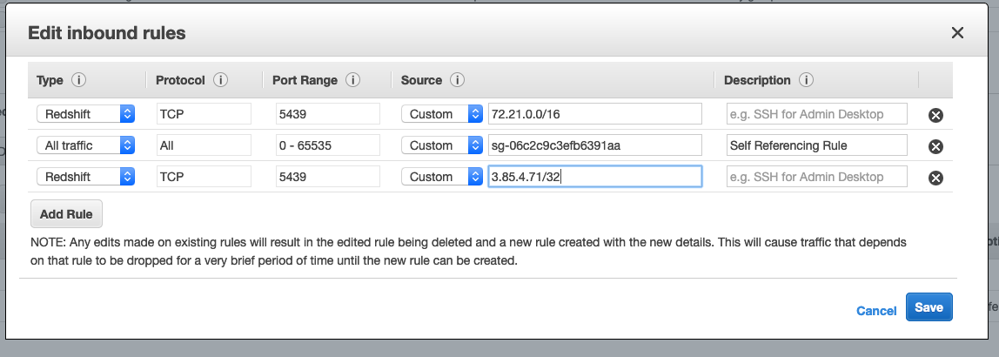
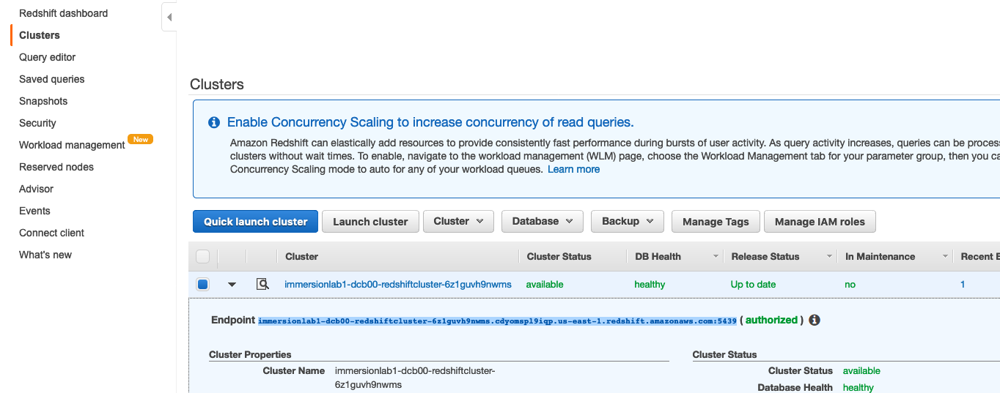

# Using Cloud9 and psql to Connect to Redshift

## Create a Cloud9 Development Environment

[AWS Cloud9](https://aws.amazon.com/cloud9/) is is a cloud-based integrated development environment (IDE) that lets you write, run, and debug your code with just a browser.

AWS Cloud9 comes with a terminal that includes sudo privileges to the managed Amazon EC2 instance that is hosting your development environment and a preauthenticated AWS Command Line Interface. This makes it easy for you to directly access AWS services, install additional software, do a git push, or enter commands.

### Navigate to the Cloud9 Console

* In the AWS Console, use the Services menu and navigate to the Cloud9 console.  One way to do so, is to expand the Services top menu and type "Cloud9" in the service search field.


### Create a Cloud9 development environment

* In the Cloud9 console, click on "Create environment".  

* Enter "redshift_[your_initials]" for the name.

Note: As multiple users may be using the same account bucket in the labs, please use your initials when creating/naming the environment.

* Fill in a description.

* Click "Next step"



* On the "Configure settings" page, leave the defaults as-is.

* Click "Next step"


* Click "Create environment"



Cloud9 will now create your new environment.  It will take a few minutes for the environment to be ready.   While waiting, you can start to review the Cloud9 IDE tutorial in the step below.

### Get familiar with Cloud9
If you are new to Cloud9, review the IDE tutorial at [https://docs.aws.amazon.com/cloud9/latest/user-guide/tutorial-tour-ide.html](https://docs.aws.amazon.com/cloud9/latest/user-guide/tutorial-tour-ide.html)


## Install psql for connecting to Redshift

We will use the standard psql client tool from the open source postgres project as a client for Redshift.

You can find psql information [here](https://www.postgresql.org/docs/8.4/app-psql.html).


* Open up your Cloud9 environment if not already open



* Click on the + sign to the right of the Welcome Tab and use the pop-up menu to open a new Terminal tab as shown below:


* In the terminal, paste and run the following code to setup the boto3 and java 1.8 environment.

```
sudo yum -y update
sudo yum -y install postgresql postgresql-devel postgresql-contrib

```

When the code is finished running, you should see output like this:


## Setup network access between Cloud9 and your Redshift cluster

NOTE: If you are following the Redshift Immersion Day lab and you left the InboundTraffic parameter at its default of 0.0.0.0/0, then you do not need to do this section.

* While leaving your Cloud9 environment open, navigate to the EC2 Console in a different browser tab.

* Click on Instances on the left hand column.  Select the ec2 instance that corresponds to your Cloud9 environment.  Make a note of the Public IP address.  For instance, copy the Public IP address to your clipboard as shown:


* Click on "Security Groups" under "NETWORK & SECURITY" on the left-hand column.  Then select the Security Group that corresponds to your Redshift Cluster.  If following the Redshift Immersion Day labs, its name will be prefixed with the name you gave your CloudFormation stack.

* Be sure the "Inbound" tab is selected on the bottom half of the page and then click Edit.



* In the pop-up, click "Add Rule".  

* In the new line, use the Type drop-down to choose Redshift

* In the source field, enter/paste the Public IP address of your Cloud9 ec2 instance AND append "/32" to it.



* Click the Save button


## Gather the endpoint hostname of your Redshift cluster

If following the Immersion Day labs, this information can be found in the Outputs section of your CloudFormation stack.  Or it can be found via the Redshift console.  We will use the Redshift console to look this up.

* Navigate to the Redshift console

* Click on Clusters on the left hand column.  Then select your redshift cluster.

* In the bottom half of the screen, select the endpoint and copy it.




## Connect from Cloud9 to Redshift

* Switch back to your open Cloud9 browser tab

* Open up a New File by clicking the + sign to the right of the Terminal tab


* Paste the endpoint in the new file


* Go back to your bash terminal and paste BUT DONT RUN YET the following code

```
psql -p 5439 -U awsuser -d dev -h ENDPOINT-WITHOUT-:5439
```


* Delete the part of the command that says "ENDPOINT-WITHOUT-:5439"

* Go to your new file and copy the hostname part of the endpoint (that is don't copy the :5439 part).

* Go back to your bash terminal and paste the hostname and run the command


* Enter the password and have fun.

Note: if you followed the Immersion Day labs and didn't change the default password in the CloudFormation template, then the awsuser password will default to Awsuser123


You can find documentation for psql usage [here](https://www.postgresql.org/docs/8.4/app-psql.html)

